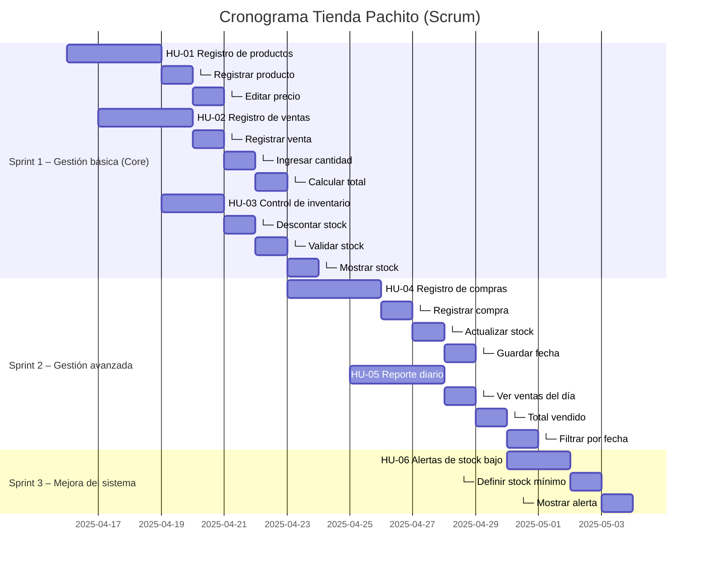

```mermaid
gantt
    title Cronograma Tienda Pachito (Scrum)
    dateFormat  YYYY-MM-DD
    todayMarker on

    section Sprint 1 – Gestión básica (Core)
    HU-01 Registro de productos           :a1, 2025-04-16, 3d
    └─ Registrar producto                :a2, after a1, 1d
    └─ Editar precio                     :a3, after a2, 1d

    HU-02 Registro de ventas             :b1, 2025-04-17, 3d
    └─ Registrar venta                   :b2, after b1, 1d
    └─ Ingresar cantidad                 :b3, after b2, 1d
    └─ Calcular total                    :b4, after b3, 1d

    HU-03 Control de inventario          :c1, 2025-04-19, 2d
    └─ Descontar stock                   :c2, after c1, 1d
    └─ Validar stock                     :c3, after c2, 1d
    └─ Mostrar stock                     :c4, after c3, 1d

    section Sprint 2 – Gestión avanzada
    HU-04 Registro de compras            :d1, 2025-04-23, 3d
    └─ Registrar compra                  :d2, after d1, 1d
    └─ Actualizar stock                  :d3, after d2, 1d
    └─ Guardar fecha                     :d4, after d3, 1d

    HU-05 Reporte diario                 :e1, 2025-04-25, 3d
    └─ Ver ventas del día                :e2, after e1, 1d
    └─ Total vendido                     :e3, after e2, 1d
    └─ Filtrar por fecha                 :e4, after e3, 1d

    section Sprint 3 – Mejora del sistema
    HU-06 Alertas de stock bajo          :f1, 2025-04-30, 2d
    └─ Definir stock mínimo              :f2, after f1, 1d
    └─ Mostrar alerta                    :f3, after f2, 1d
```

---
