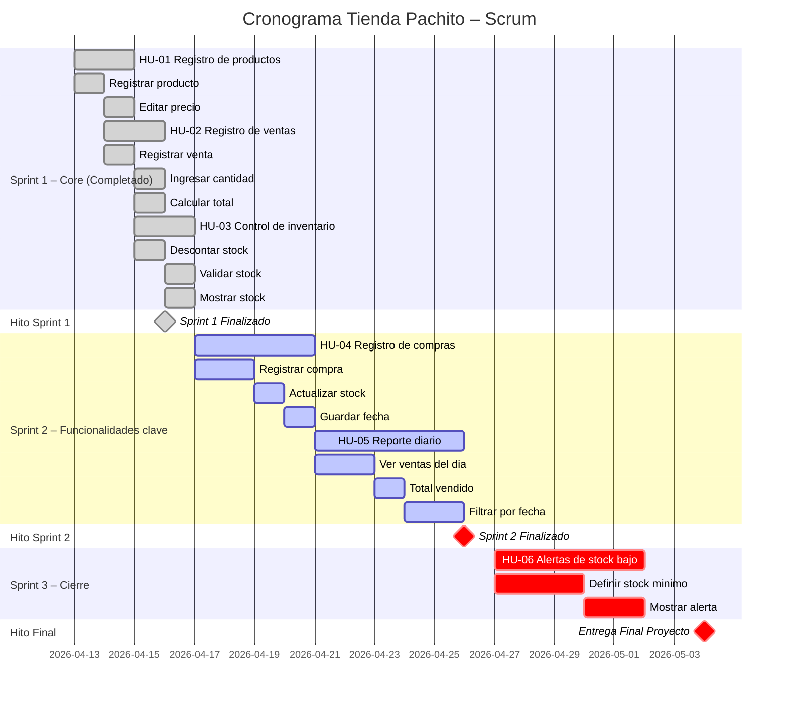

```mermaid
gantt
    title Cronograma Tienda Pachito – Scrum
    dateFormat  YYYY-MM-DD
    todayMarker on

    section Sprint 1 – Core (Completado)
    HU-01 Registro de productos     :done, a1, 2026-04-13, 2d
    Registrar producto               :done, a2, 2026-04-13, 1d
    Editar precio                    :done, a3, 2026-04-14, 1d
    HU-02 Registro de ventas        :done, b1, 2026-04-14, 2d
    Registrar venta                  :done, b2, 2026-04-14, 1d
    Ingresar cantidad                :done, b3, 2026-04-15, 1d
    Calcular total                   :done, b4, 2026-04-15, 1d
    HU-03 Control de inventario     :done, c1, 2026-04-15, 2d
    Descontar stock                  :done, c2, 2026-04-15, 1d
    Validar stock                    :done, c3, 2026-04-16, 1d
    Mostrar stock                    :done, c4, 2026-04-16, 1d

    section Hito Sprint 1
    Sprint 1 Finalizado              :milestone, done, 2026-04-16, 0d

    section Sprint 2 – Funcionalidades clave
    HU-04 Registro de compras       :active, d1, 2026-04-17, 4d
    Registrar compra                 :active, d2, 2026-04-17, 2d
    Actualizar stock                 :active, d3, 2026-04-19, 1d
    Guardar fecha                    :active, d4, 2026-04-20, 1d
    HU-05 Reporte diario            :active, e1, 2026-04-21, 5d
    Ver ventas del dia               :active, e2, 2026-04-21, 2d
    Total vendido                    :active, e3, 2026-04-23, 1d
    Filtrar por fecha                :active, e4, 2026-04-24, 2d

    section Hito Sprint 2
    Sprint 2 Finalizado              :milestone, crit, 2026-04-26, 0d

    section Sprint 3 – Cierre
    HU-06 Alertas de stock bajo     :crit, f1, 2026-04-27, 5d
    Definir stock minimo             :crit, f2, 2026-04-27, 3d
    Mostrar alerta                   :crit, f3, 2026-04-30, 2d

    section Hito Final
    Entrega Final Proyecto           :milestone, crit, 2026-05-04, 0d
```

