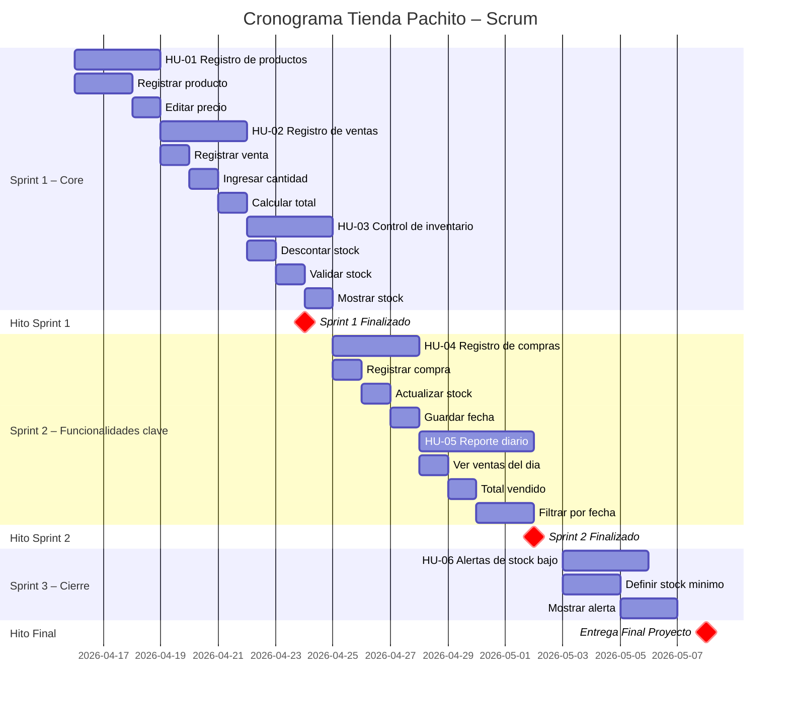

```mermaid
gantt
    title Cronograma Tienda Pachito – Scrum
    dateFormat  YYYY-MM-DD
    todayMarker on

    section Sprint 1 – Core
    HU-01 Registro de productos     :a1, 2026-04-16, 3d
    Registrar producto               :a2, 2026-04-16, 2d
    Editar precio                    :a3, 2026-04-18, 1d
    HU-02 Registro de ventas        :b1, 2026-04-19, 3d
    Registrar venta                  :b2, 2026-04-19, 1d
    Ingresar cantidad                :b3, 2026-04-20, 1d
    Calcular total                   :b4, 2026-04-21, 1d
    HU-03 Control de inventario     :c1, 2026-04-22, 3d
    Descontar stock                  :c2, 2026-04-22, 1d
    Validar stock                    :c3, 2026-04-23, 1d
    Mostrar stock                    :c4, 2026-04-24, 1d

    section Hito Sprint 1
    Sprint 1 Finalizado              :milestone, crit, 2026-04-24, 0d

    section Sprint 2 – Funcionalidades clave
    HU-04 Registro de compras       :d1, 2026-04-25, 3d
    Registrar compra                 :d2, 2026-04-25, 1d
    Actualizar stock                 :d3, 2026-04-26, 1d
    Guardar fecha                    :d4, 2026-04-27, 1d
    HU-05 Reporte diario            :e1, 2026-04-28, 4d
    Ver ventas del dia               :e2, 2026-04-28, 1d
    Total vendido                    :e3, 2026-04-29, 1d
    Filtrar por fecha                :e4, 2026-04-30, 2d

    section Hito Sprint 2
    Sprint 2 Finalizado              :milestone, crit, 2026-05-02, 0d

    section Sprint 3 – Cierre
    HU-06 Alertas de stock bajo     :f1, 2026-05-03, 3d
    Definir stock minimo             :f2, 2026-05-03, 2d
    Mostrar alerta                   :f3, 2026-05-05, 2d

    section Hito Final
    Entrega Final Proyecto           :milestone, crit, 2026-05-08, 0d
```
