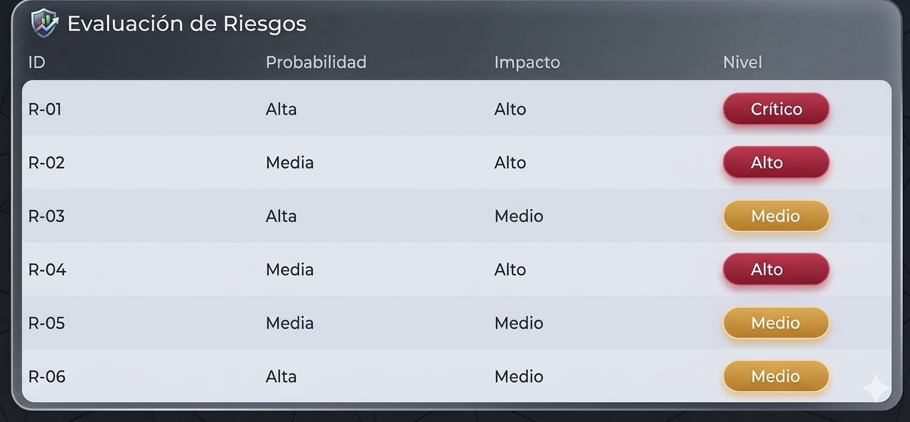

# Gestión de Riesgos

## Identificación de Riesgos

### 🔹 R-01 – Error en actualización de stock
**Descripción:**  
El sistema no descuenta correctamente el inventario después de una venta.  
**Tipo de riesgo:** Proceso / Software  

### 🔹 R-02 – Pérdida de datos
**Descripción:**  
La base de datos puede perder información por fallos o falta de respaldo.  
**Tipo de riesgo:** Seguridad / Técnico  

### 🔹 R-03 – Requisitos mal definidos
**Descripción:**  
El dueño cambia constantemente lo que necesita del sistema.  
**Tipo de riesgo:** Requisitos / Gestión  

### 🔹 R-04 – Fallos en registro de ventas
**Descripción:**  
Errores en el cálculo automático del total de una venta.  
**Tipo de riesgo:** Software  

### 🔹 R-05 – Falta de experiencia del equipo
**Descripción:**  
El equipo puede no dominar completamente las tecnologías usadas.  
**Tipo de riesgo:** Recurso humano  

### 🔹 R-06 – Retrasos en el desarrollo
**Descripción:**  
Las funcionalidades no se entregan en el tiempo planeado.  
**Tipo de riesgo:** Cronograma  

---

##  Matriz de riesgos

---

## Priorización de Riesgos

### 🔴 Riesgos Críticos
- R-01 Error en stock  

### 🔴 Riesgos Altos
- R-02 Pérdida de datos  
- R-04 Fallos en ventas  

### 🟡 Riesgos Medios
- R-03 Requisitos cambiantes  
- R-05 Falta de experiencia  
- R-06 Retrasos  

---

## Plan de Mitigación

### 🔹 R-01 – Error en stock
**Estrategia:** Reducir  
**Acciones:**
- Pruebas unitarias en ventas  
- Validación automática de stock  
- Bloqueo de ventas sin inventario  

### 🔹 R-02 – Pérdida de datos
**Estrategia:** Reducir / Transferir  
**Acciones:**
- Backups automáticos diarios  
- Uso de base de datos en la nube  

### 🔹 R-03 – Requisitos cambiantes
**Estrategia:** Reducir  
**Acciones:**
- Definir requisitos por sprint  
- Validación con el cliente antes de desarrollar  

### 🔹 R-04 – Fallos en ventas
**Estrategia:** Reducir  
**Acciones:**
- Pruebas de cálculo  
- Validación de entradas (cantidad, precio)  

### 🔹 R-05 – Falta de experiencia
**Estrategia:** Reducir  
**Acciones:**
- Capacitación básica del equipo  
- Uso de tecnologías conocidas  

### 🔹 R-06 – Retrasos
**Estrategia:** Aceptar / Reducir  
**Acciones:**
- Dividir tareas pequeñas  
- Seguimiento por sprint  

---

## 🔄 Monitoreo de Riesgos
- Revisión en cada sprint  
- Seguimiento en reuniones Scrum  
- Ajuste de estrategias según avance  