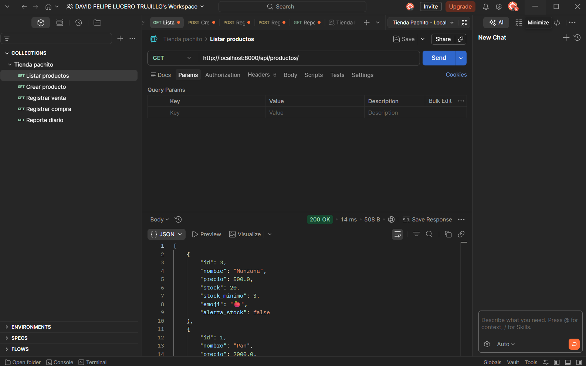
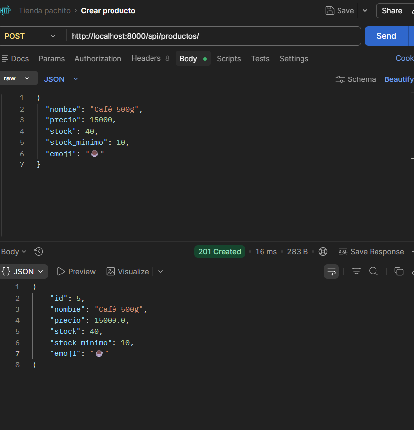
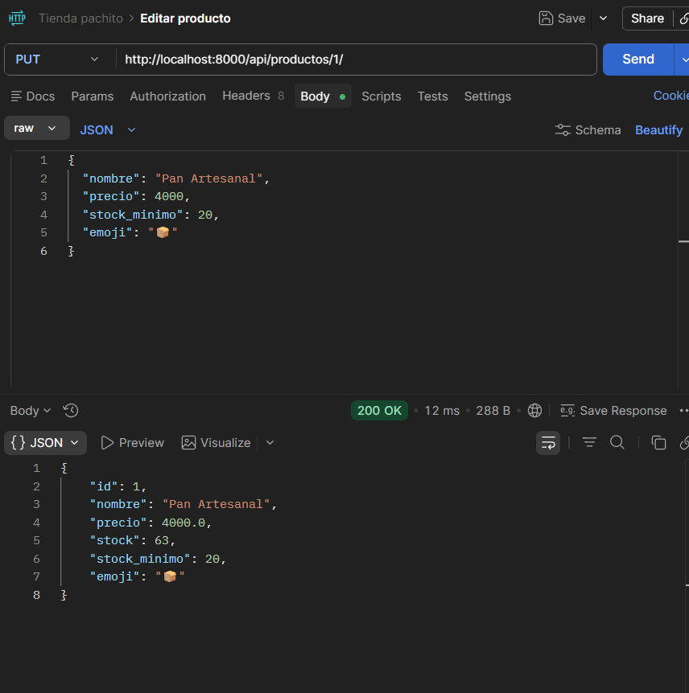
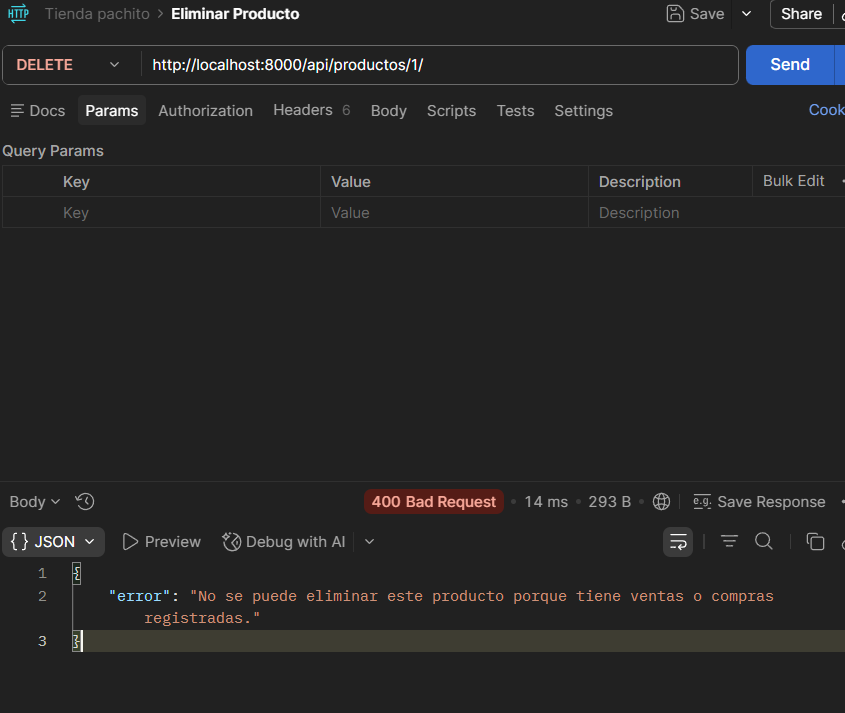

## 🌐 Endpoints Postman

| Método | Endpoint | Descripción |
|--------|----------|-------------|
| GET | `/api/productos/` | Listar todos los productos |
| POST | `/api/productos/` | Crear producto |
| GET | `/api/productos/{id}/` | Ver producto por ID |
| PUT | `/api/productos/{id}/` | Editar producto |
| DELETE | `/api/productos/{id}/` | Eliminar producto |
| GET | `/api/alertas/stock/` | Productos con stock bajo |
| GET | `/api/ventas/` | Listar ventas |
| GET | `/api/ventas/?fecha=YYYY-MM-DD` | Ventas por fecha |
| POST | `/api/ventas/` | Registrar venta |
| GET | `/api/compras/` | Listar compras |
| POST | `/api/compras/` | Registrar compra |
| GET | `/api/reportes/diario/?fecha=YYYY-MM-DD` | Reporte diario |
| GET | `/api/reportes/rango/?fecha_inicio=...&fecha_fin=...` | Reporte por rango |

### Ejemplos de cuerpo JSON para Postman:

**POST /api/productos/**
```json
{
  "nombre": "Café 500g",
  "precio": 15000,
  "stock": 40,
  "stock_minimo": 10,
  "emoji": "☕"
}
```



**PUT /api/productos/1/**
```json
{
  "precio": 3800,
  "stock_minimo": 20
}
```


**POST /api/ventas/**
```json
{
  "producto_id": 1,
  "cantidad": 3
}
```

**POST /api/compras/**
```json
{
  "producto_id": 2,
  "cantidad": 50,
  "costo_unitario": 3200
}
```

**DELETE http://localhost:8000/api/productos/1/**

---

## 🧪 Pruebas Postman

[Ver colección de Postman JSON](https://github.com/Manuel-Posada/Proyecto-Tienda-Pachito/blob/main/9.Evidencias/Postman/Tienda%20pachito.postman_collection.json)


### Cómo importar en Postman:
1. Abre Postman
2. Clic en **Import**
3. Arrastra el archivo `Tienda_Pachito.postman_collection.json`
4. También importa el archivo de entorno `Tienda_Pachito.postman_environment.json`
5. Selecciona el entorno **Tienda Pachito - Local** en la esquina superior derecha
6. Asegúrate que Django esté corriendo antes de ejecutar las pruebas
